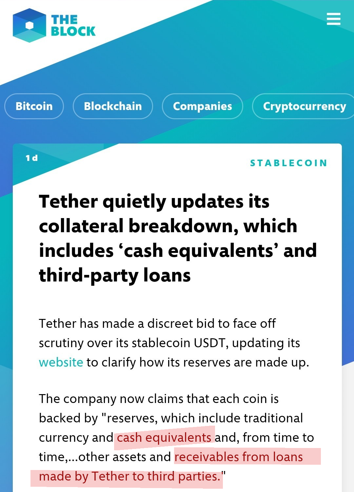
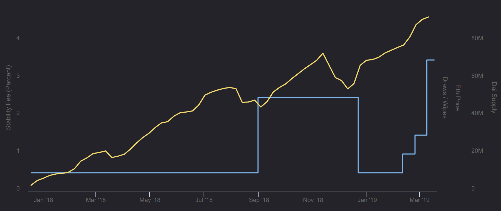
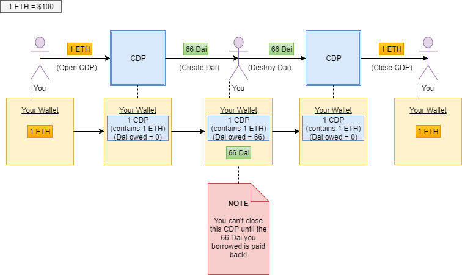

##

1. MakerDAO - A Short History
2. Stable coins
3. Dai
4. Governance
5. The big picture - Discussion and Outlook

---

## MakerDAO

##

~~affiliated~~

- [geoplex.de](https://geoplex.de) - 2D/3D GIS
- [syncrypt.space](https://syncrypt.space) - Encrypted cloud storage

## Short history

- Bitcoin (2008)
- Ethereum mainnet launch (2015)
- The DAO (2016)
- Already in 2014: MakerDAO was founded by Rune Christensen

## Back then

- A company "founded in a chat room" / No jurisdiction
- No ICO
    - Private sales to friends, family and investors
    - Goal: Responsible token holders as owners
- First MakerDAO owner token issued on Bitshares

## Nowadays

- Moved to Ethereum: MKR is an ERC20 token
- Distributed: 100 Employees in ~30 Cities
- [Investment since 2017 ~$27M, Andreessen Horowitz, Polychain Capital and others](https://www.crunchbase.com/organization/makerdao#section-funding-rounds)
- MakerDAO Foundation registered several legal companies

---

## Stable coins

##

"You need stablecoins to realize the full potential of blockchain technology."

## Why?

- Augur bet in 6 months
- ICO participation (both sides)
- Remittances
- etc.

→ Majority of use cases *require* a stable coin.

## Basic requirements

- Pegged to a reference value ($, €, IMF SDR, ...)
- Backed by something to assert value

## Risks

- Risk #1: Irrational market 🙃
- Risk #2: Counter Party / Collateral 😕

## One Solution

*Fiat-backed stablecoins* are IOU tokens and are usually backed by a bank
balance.

## Examples

* Tether (USDT, 2.000 Mio US$)
* USD-C (Circle/Coinbase, 239 Mio US$)
* TrueUSD (TrustToken, 198 Mio US$)
* Gemini Dollar (65 Mio US$)
* PAXOS, JPM Coin (JP Morgan), ...

## The Risks

- Risk #1: Irrational market 🙃
    - COIN < USD:
        - Arbitrage opportunity because of IOU redemption (Redeemability)
    - COIN > USD:
        - Arbitrage opportunity as long as you can buy/mint

- Risk #2: Counter Party / Collateral 😕
    - Blind trust, or
    - Periodic audits to prove solvency of the IOU company

##

<small>March 14, 2019</small>

{ .plain width=60% }

## Audits

- Third party audits a remedy?
- Tether: 2017 no audits, 2018 claims to have been audited by sketchy firms
- TrueUSD: Monthly audit by Cohen & Company, a top 50 U.S. public accounting firm
- Trust is deligated. Meh.

##

Is there a better way?

---

## Dai

##

<svg width="305" height="123" viewBox="0 0 305 123" fill="none" style="margin-bottom: 2.2rem;"><g filter="url(#filter0_d)"><rect x="7" y="5" width="109" height="109" rx="45" fill="white"></rect></g><g filter="url(#filter1_d)"><rect x="188.667" y="5" width="109" height="109" rx="45" fill="white"></rect></g><path d="M38.4601 76.2686H46.3641V39.6086H40.9041L30.4521 42.7286L32.1161 49.2806L38.4601 47.7206V76.2686Z" fill="#FDB134"></path><path d="M253.432 76.2686H261.336V39.6086H255.876L245.424 42.7286L247.088 49.2806L253.432 47.7206V76.2686Z" fill="#30BD9F"></path><path d="M226.592 76.3328H230.159V72.2738C235.366 71.8228 238.892 68.8298 238.892 64.3608V64.2788C238.892 59.8918 236.227 57.3908 229.995 55.8328V48.0428C231.922 48.4528 233.767 49.3138 235.571 50.6668L237.867 46.8128C235.612 45.1318 233.152 44.0658 230.159 43.6968V41.2368H226.592V43.6148C221.467 44.0248 217.982 47.0178 217.982 51.4458V51.5278C217.982 56.1198 220.77 58.3748 226.756 59.9328V67.9688C224.091 67.5588 221.877 66.3288 219.54 64.4428L216.916 68.1738C219.704 70.3878 223.025 71.8228 226.592 72.2328V76.3328ZM226.756 54.9718C223.599 54.0288 222.82 52.9218 222.82 51.2408V51.1588C222.82 49.3548 224.173 47.9608 226.756 47.7558V54.9718ZM229.995 68.1328V60.7118C233.193 61.6548 234.054 62.7618 234.054 64.5658V64.6478C234.054 66.6158 232.578 67.9278 229.995 68.1328Z" fill="#30BD9F"></path><path d="M163.146 55.9366H140.342V51.5343H163.146V55.9366ZM163.146 67.2843H140.342V62.9093H163.146V67.2843Z" fill="#ABBAC8"></path><g filter="url(#filter2_i)"><path d="M75.1255 39.3174L93.797 57.9873L75.1255 76.6575L56.4541 57.9873L75.1255 39.3174Z" fill="url(#paint0_radial)"></path></g><path opacity="0.16" d="M74.9795 76.6543V39.3148L93.464 57.9845L74.9795 76.6543V76.6543Z" fill="white"></path><path d="M63.3575 56.2674C63.1859 56.461 63.3233 56.7665 63.582 56.7665H71.2263C71.3118 56.7665 71.3933 56.7299 71.4502 56.666L74.7679 52.9428C74.883 52.8136 75.0833 52.8084 75.205 52.9313L78.9141 56.6775C78.9704 56.7344 79.0472 56.7665 79.1273 56.7665H86.7661C87.0271 56.7665 87.1636 56.4562 86.9873 56.2638L75.2052 43.4043C75.085 43.2731 74.8776 43.2748 74.7595 43.408L63.3575 56.2674Z" fill="white"></path><defs><filter id="filter0_d" x="0" y="0" width="123" height="123" filterUnits="userSpaceOnUse" color-interpolation-filters="sRGB"><feFlood flood-opacity="0" result="BackgroundImageFix"></feFlood><feColorMatrix in="SourceAlpha" type="matrix" values="0 0 0 0 0 0 0 0 0 0 0 0 0 0 0 0 0 0 127 0"></feColorMatrix><feOffset dy="2"></feOffset><feGaussianBlur stdDeviation="3.5"></feGaussianBlur><feColorMatrix type="matrix" values="0 0 0 0 0.918812 0 0 0 0 0.937606 0 0 0 0 0.9564 0 0 0 1 0"></feColorMatrix><feBlend mode="normal" in2="BackgroundImageFix" result="effect1_dropShadow"></feBlend><feBlend mode="normal" in="SourceGraphic" in2="effect1_dropShadow" result="shape"></feBlend></filter><filter id="filter1_d" x="181.667" y="0" width="123" height="123" filterUnits="userSpaceOnUse" color-interpolation-filters="sRGB"><feFlood flood-opacity="0" result="BackgroundImageFix"></feFlood><feColorMatrix in="SourceAlpha" type="matrix" values="0 0 0 0 0 0 0 0 0 0 0 0 0 0 0 0 0 0 127 0"></feColorMatrix><feOffset dy="2"></feOffset><feGaussianBlur stdDeviation="3.5"></feGaussianBlur><feColorMatrix type="matrix" values="0 0 0 0 0.918812 0 0 0 0 0.937606 0 0 0 0 0.9564 0 0 0 1 0"></feColorMatrix><feBlend mode="normal" in2="BackgroundImageFix" result="effect1_dropShadow"></feBlend><feBlend mode="normal" in="SourceGraphic" in2="effect1_dropShadow" result="shape"></feBlend></filter><filter id="filter2_i" x="56.4541" y="39.3174" width="37.3429" height="38.3401" filterUnits="userSpaceOnUse" color-interpolation-filters="sRGB"><feFlood flood-opacity="0" result="BackgroundImageFix"></feFlood><feBlend mode="normal" in="SourceGraphic" in2="BackgroundImageFix" result="shape"></feBlend><feColorMatrix in="SourceAlpha" type="matrix" values="0 0 0 0 0 0 0 0 0 0 0 0 0 0 0 0 0 0 127 0" result="hardAlpha"></feColorMatrix><feOffset dy="1"></feOffset><feGaussianBlur stdDeviation="1.5"></feGaussianBlur><feComposite in2="hardAlpha" operator="arithmetic" k2="-1" k3="1"></feComposite><feColorMatrix type="matrix" values="0 0 0 0 1 0 0 0 0 0.810252 0 0 0 0 0.362445 0 0 0 1 0"></feColorMatrix><feBlend mode="normal" in2="shape" result="effect1_innerShadow"></feBlend></filter><radialGradient id="paint0_radial" cx="0" cy="0" r="1" gradientUnits="userSpaceOnUse" gradientTransform="translate(75.1255 57.9874) rotate(90) scale(18.67 18.6714)"><stop stop-color="#FFDB87"></stop><stop offset="1" stop-color="#FFBD21"></stop></radialGradient></defs></svg>

- ERC20 Token
- pegged to USD
- launched Dec 2017

## Idea

Provide stability by

- Collateralized Debt Positions (CDPs),
- autonomous feedback mechanisms, and
- appropriately incentivized external actors.

##

Sounds fancy, how does it work?

## CDP

- Smart contract (think verifiable vending machine)
- Automated way to create and repay loans
- A smart contract can only operate on data that is on the blockchain

## Most important slide

|            | Paid in   | Collateral   |
| ---------- | --------- | ------------ |
| Bank loan  | Euro      | Your house   |
| CDP        | Dai       | Ether        |

##

Can we deal with the risks in a decentralized manner?

## Dealing with the risks

- Risk #1: Irrational market 🙃
    - NOT redeemable!
    - Arbitrage (Keeper bots)
    - Dai < USD:
        - System incentives repayment of CDPs
    - Dai > USD:
        - System incentives creation of CDPs

→ Basically supply is controlled by incentives

## Dealing with the risks

- Risk #2: Counter Party / Collateral 😕

    - On-chain "staking" of collateral
    - Always over-collateralized ("Secure debt"), because of volatile nature of the asset

## How much Dai can I draw?

{ .plain width=20% }

- The amount of Dai depends on the price of ETH
- The ratio is called "collateralization ratio"
- Must be higher than the "liquidation ratio" (150%)

## If Ether goes up

{ .plain width=40% }

- Not a problem, collateralization ratio goes up
- Dai gets stronger as there is more collateral
- Payback amount in Dai does not change

##

{ .plain width=40% }

Use Dai to buy more of the collateral asset.

→ Decentralized margin long

## If Ether goes down

{ .plain width=20% }

- May become a problem: A CDP can become "under-collateralized".
- Forced liquidation when hitting liquidation ratio (Margin call)

## Liquidation

{ .plain width=20% }

- Auctions part the your collateral to the highest bidder
- Adds a penalty (13% of borrowed assets) to incentivize high collateralization ratios

## Returning your Dai

{ .plain width=20% }

- If you want to access your collateral, you have to close repay the borrowed Dai.
- Pay stability fees in relation to the holding period

##

All is good!

## Is it?

{ .plain }

---

## Governance

##

- Who sets the collateralization ratio?
- Who sets the stability fee?
- Who white-lists the oracle price feeds?
- Who decides which tokens can be used as collateral?

→ MKR holders

## MKR Token

- Governance (https://vote.makerdao.com/)
- Insurance against black swan events
- Receive a compensation
- Basic idea: "Share risk and profit"

## Global settlement

- Last resort shutdown
- Everyone can claim the net value of the collateral they are entitled to
- Can be triggered by whitelisted MKR holders

## Stability Fees

- Stability fees are collected in MKR and send to a burner contract
- By shrinking supply, MKR holders are rewarded for taking on the involved risks

## Community

- Friendly community
- Weekly Community Calls / Governance Calls

> "We are dedicated to providing material for new people to understand the system
> in depth. This will be important for successful governance in the project's
> future."

##

{ width=77% }

<small>Symbiotic relationship: Dapps need Dai, MakerDAO need Dapps [Medium post](https://medium.com/@cyrus.younessi/an-elegant-relationship-dai-eth-mkr-4e4d5e69590)</small>

##

Ok, but does it work?

##

{ .plain }

## Scale

* USD 4 Million in BTC Lightning Network
* USD 300 Million in CDPs (~2 % of all ETH)

##

## Dai Supply and stability fee

{ .plain }

## Where we at?

* Tether (USDT, 2.000 Mio US$)
* USD-C (Circle/Coinbase, 239 Mio US$)
* TrueUSD (TrustToken, 198 Mio US$)
* **Dai (95 Mio US$)**
* Gemini Dollar (65 Mio US$)

---

## Discussion

##

1. Use cases and related projects
2. Risks and criticism
3. Future developments
4. Wrap up / The big picture

## Use cases and related projects

- Ether on margin
- Decentralized bank [InstaDApp](https://instadapp.io/)
- Real estate investing [FACTOR-805](https://www.forbes.com/sites/rachelwolfson/2019/02/20/stablecoins-could-unleash-wall-street-adoption-of-blockchain-technology/#617f3ea2453c)
- [Compound Finance](https://compound.finance/) - Pool assets and receive interest, supports Dai

## xDai Chain

- Ethereum side chain built by POA Network
- Proof of Authority, [5 second block time](https://blockscout.com/poa/dai)
- XDai native token (representation of Dai)
- Locking ERC20 tokens on Mainnet will mint those on side chain
- [xdai.io Burner Wallet](https://xdai.io/)
- Powered food trucks on ETHDenver 2019 (~35k USD turnover)

## Criticism 1/2

- Deflation risk of the collateral ("CDPs swallowing ETH")
- Failure of governance
- Regulatory uncertainty
    - Who fights the legal wars? InstaDApp or MakerDAO?
    - Taxes?

## Criticism 2/2

- [Inability to scale to a global stable currency?](https://medium.com/reserve-currency/our-analysis-of-the-makerdao-protocol-4a9872c1a824)
    - Might not be able to meet demand, while keeping over-collateralization
- Price Wars with non-decentralized projects
    - Tether could clone the system and offer 0 % loans
    - Leverage up to 1.67 % / BitMEX up to 100%

## Alternatives

- Algorithmic Supply Stablecoins
- Metal-backed Stablecoins (DigixDAO)
- [Other](https://stablecoinindex.com/projects)

## Future developments

## Multi-Collateral Dai

{ .plain width=70% }

More stability and scalability through diversification

- ERC20
- BTC
- Tokenized Bonds/Stocks/Art
- ...

##

→ Any collateral could be valid. As long as sensible parameters are chosen.

## Next level

<!-- https://www.youtube.com/watch?v=C234gKqJw48&feature=youtu.be&t=5152 -->

{ .plain width=45% }

- Clone contract and use Dai as collateral
- Ability to create synthetic assets:
    - Synthetic gold
    - Synthetic stock index
    - Leveraged margin short
    - "Not insured" by MKR holders

<!-- - "Short into existence"
# - Take synthetic assets as collateral
#    - Let's go full circle
#    - Margin Long -->

## The Big Picture

## Triffin Dilemma

- National currency as world reserve currency
    - Controlling supply and demand of own economy
    - vs. providing enough supply for the world
- This dilemma killed the gold standard of USD

##

If you squint, MakerDAO looks alot like a central bank.

## Yea, but...

- A *sound*, *transparent*, *non-fractional-reserve* bank
- Supranational: Not bound to any specific economy
- Restricted by design: Code-as-law

##

To overcome the Triffin dilemma, we need a *stable* currency which is *governed globally* and *independent of any specific state or economic area*.

Sound familiar?

<small class="fragment">If interested, watch this talk: [MakerDAO: A New Hope for Financial Reform](https://www.youtube.com/watch?v=2lxc7qCsvF8)</small>

## Links

- https://makerdao.com/en/whitepaper/
- [Purple Paper - Reference implementation in Haskell](https://makerdao.com/purple/)
- [MKR Tools](https://mkr.tools/)
- [MakerScan](https://makerscan.io/)
- https://www.daiembassy.online/
- https://github.com/makerdao/awesome-makerdao

# That's it

Thanks for listening! Any questions?

<small>Twitter/GitHub @lordi</small>

---

## Bonus slides

## Oracles

- "The smart contract needs to know the price of ETH"
- "A smart contract can only operate on data that is on the blockchain"
- Oracles to the rescue: The median value is chosen from multiple Oracle price feeds.

## Oracle contracts

* Invididually owned [Price feed contracts](https://github.com/makerdao/price-feed) will
  be called periodically and store the value.
* Then they ``poke`` the [Medianizer contract](https://github.com/makerdao/medianizer)
* On each poke, the medianizer calculates and stores the median price of all feeds.
* Governance can whitelist certain price feed contracts.

## The cool thing is

...other contracts can call ``read`` on the [Medianizer](https://github.com/makerdao/medianizer/blob/master/src/medianizer.sol#L87).

Other Dapps like Compound, Gnosis and Augur are using it.

## Room for improvement

* *n* price feeds means *n times the gas* every update.
* Possible mitigation (Oracles V2) is to instead of calling a store and poke
  function on-chain, sign+send a message to a relayer who will then post it on-chain

## ETH, WETH and PETH

ETH → WETH → PETH → Dai

- WETH: Wrapped ETH (ERC20 representation of Ether)
- PETH: Pooled ETH

## Short technical dive

- ``open`` -- initialize CDP
- ``lock`` -- lock up collateral
- ``draw`` -- issue Dai
- ``free`` -- reclaim collateral
- ``wipe`` -- send back Dai (reduce issuance)
- ``shut`` -- close CDP
- ``give`` -- transfer CDP to another owner
- ``bite`` -- trigger liquidation / apply penalty
- ``grab`` -- receive CDP's collateral while in liquidation

##

{ .plain }
